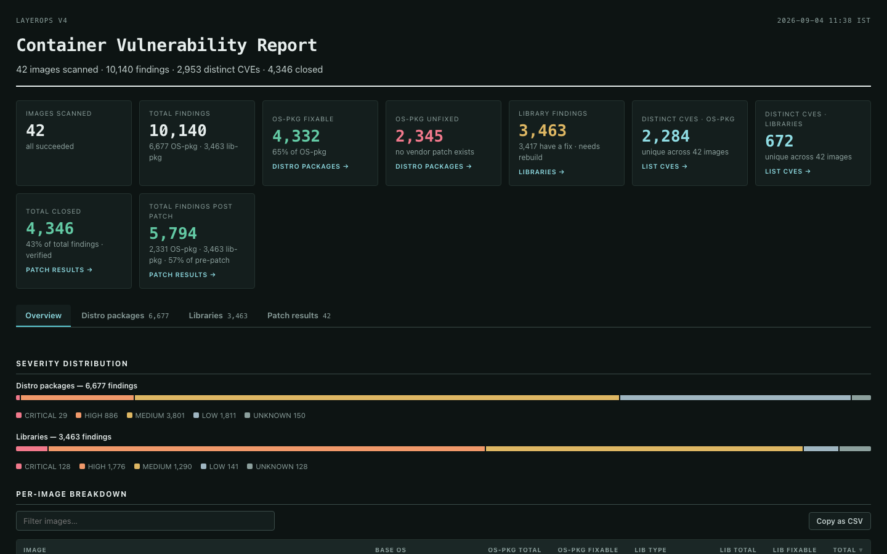
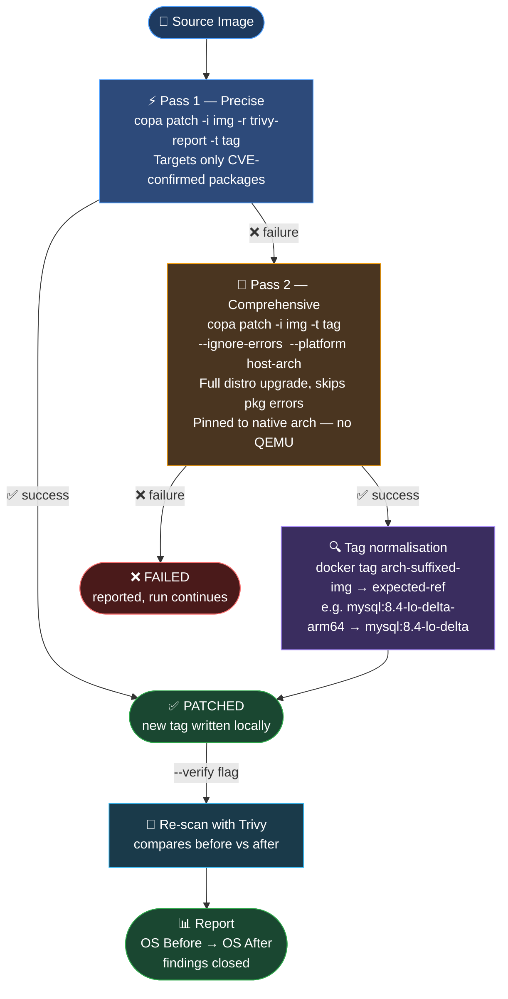

# layerops

**Zero-rebuild container vulnerability remediation.**
Assess, patch, and verify OS-package CVEs across public open-source bases, third-party vendor images, and private builds — in a single command.

**[▶ View a live sample report](https://hrushikeshkuwlekar.github.io/layerops/sample-report.html)**

[](https://hrushikeshkuwlekar.github.io/layerops/sample-report.html)

> [!NOTE]
> **Why is Total Closed higher than OS-PKG Fixable?** Package updates pull in patched transitive dependencies and distro security errata, resolving additional CVEs that Trivy initially classified as unfixed or had no vendor patch listed.

Container security stalls on images nobody can rebuild: upstream foundation images, vendor-packaged containers, legacy services whose Dockerfile and build pipeline are gone or expensive to trigger. Rebuilding an entire image to update one system package is work out of all proportion to the result.

layerops unifies [Trivy](https://github.com/aquasecurity/trivy) scanning and [Copacetic](https://github.com/project-copacetic/copacetic) in-place patching into one CLI. Across a single image (--image) or a whole inventory (--list), it separates OS packages a machine can patch from language dependencies that need a developer, then writes distro security updates into a new image tag — the original is never modified. A two-pass strategy retries with --ignore-errors when precise patching hits an epoch mismatch or renamed package, so one awkward dependency never costs you the image. Add --verify to re-scan each patched tag and report before → after. Reports export as offline HTML or CSV, with --html | --csv for CI/CD gating and visible reporting.

---

## Features

- **Assess** one image or hundreds via `--image` / `--list`
- **OS-pkg & lib-pkg** findings reported separately — distro packages vs language packages (jar, npm, pip, go)
- **Patch** fixable OS packages with copa — writes a new tag, the original image is never modified
- **Two-pass resilient patching:**
  - Pass 1 — precise, report-based (`copa -r`) targeting only CVE-confirmed packages
  - Pass 2 — if pass 1 fails (e.g. epoch version mismatches, Oracle Linux), retries with `copa --ignore-errors` (comprehensive update), pinned to the host's native CPU architecture to avoid QEMU timeouts on multi-arch images
- **Verify** patched images with a re-scan to confirm findings were actually closed
- **Distroless / scratch** images correctly labelled instead of `-`
- **HTML report** — fully offline, searchable, filterable, per-CVE detail with patch results tab and summary tiles (Total Closed, Total Findings Post Patch)
- **CSV report** — per-image + per-severity + per-CVE rows for downstream tooling
- **CI gate** — `--fail-on-fixable` exits 1 if any fixable vulnerability is found

---

## Requirements

| Tool | Purpose | macOS | Linux |
|---|---|---|---|
| [Trivy](https://github.com/aquasecurity/trivy) | Vulnerability scanning | `brew install trivy` | `apt install trivy` or see [Trivy install](https://aquasecurity.github.io/trivy/latest/getting-started/installation/) |
| [Copacetic (copa)](https://github.com/project-copacetic/copacetic) | OS package patching | `brew install copa` or see [copa install](https://project-copacetic.github.io/copacetic/website/installation) | `curl -sSL https://raw.githubusercontent.com/project-copacetic/copacetic/main/scripts/install.sh \| sh` |
| [jq](https://stedolan.github.io/jq/) | JSON processing | `brew install jq` | `apt install jq` / `yum install jq` |
| Docker (or any BuildKit daemon) | Image pull / push / BuildKit backend | [Docker Desktop](https://docs.docker.com/get-docker/) | [Docker Engine](https://docs.docker.com/engine/install/) · `docker run -d --name buildkitd --privileged moby/buildkit` |

---

## Installation

```bash
# Download and make executable
curl -fsSL https://raw.githubusercontent.com/hrushikeshkuwlekar/layerops/main/layerops \
  -o /usr/local/bin/layerops
chmod +x /usr/local/bin/layerops
```

Or clone and symlink:
```bash
git clone https://github.com/hrushikeshkuwlekar/layerops.git
ln -s "$PWD/layerops/layerops" /usr/local/bin/layerops
```

---

## Quick Start

```bash
# Scan a single image
layerops --image nginx:1.30.3

# Scan a list of images and generate an HTML report
layerops --list images.txt --html report.html

# Scan + patch + verify + HTML + CSV report
layerops --list images.txt --patch --verify --html report.html --csv report.csv

# CI gate — fail if any fixable vuln exists
layerops --list images.txt --fail-on-fixable
```

---

## Usage

```
Usage: layerops --image <repo:tag> [more --image ...] [options]
       layerops --list <file> [options]
       layerops --from-json <file> [options]

Input:
  -i, --image <ref>       Image to scan. Repeat the flag for several images.
  -l, --list <file>       File of image refs, one per line (# comments allowed).
  -f, --from-json <file>  Summarise an existing Trivy JSON report, no scanning.

Output:
  -c, --class <name>      os-pkgs | lib-pkgs | all         (default: all)
      --csv <file>        Write the full report as CSV
      --html <file>       Write a standalone HTML report (offline, shareable)
      --json-dir <dir>    Keep each image's raw Trivy JSON in this directory
  -o, --save-json <file>  Single-image mode: keep the raw Trivy JSON here

Scan:
  -p, --pkg-types <list>  Trivy package types              (default: os,library)
  -s, --severity <list>   Limit severities, e.g. CRITICAL,HIGH
  -q, --quiet             Suppress Trivy progress output (and copa when patching)
      --fail-on-fixable   Exit 1 if any fixable vulnerability is found (CI gate)

Patch (Copacetic):
      --patch             Patch fixable os-pkgs with copa, write a new local tag
      --patch-suffix <s>  Tag suffix for patched images    (default: lo-delta)
      --verify            Re-scan each patched image and report before -> after
      --copa-addr <addr>  BuildKit address, e.g. tcp://0.0.0.0:8888
      --patch-timeout <d> Per-image copa timeout, both passes (default: 15m)
  -qc, --copa-quiet       Hide copa BuildKit output (shown on failure)
  -Qc, --copa-verbose     Show copa output even under --quiet

  -h, --help              This help
```

---

## How Patching Works



- **Pass 1** is precise — it uses the Trivy report to target only packages with known CVEs and fixed versions.
- **Pass 2** triggers automatically on any Pass 1 failure (epoch mismatches, Oracle Linux rejection, etc.) — it runs a full distro upgrade with `--ignore-errors` to skip individual package failures.
- **Native arch pinning** — Pass 2 is pinned to the host CPU (e.g. `linux/arm64` on Apple Silicon) to avoid QEMU emulation timeouts on multi-arch images.
- **Tag normalisation** — Docker Hub library images are stored without the `docker.io/library/` prefix and with an arch suffix (e.g. `mysql:8.4-lo-delta-arm64`). `layerops` detects and aliases these to the expected ref so `--verify` and reports work correctly.

---

## HTML Report

The generated HTML report is fully self-contained (no CDN, no server) and includes:

- **Summary tiles** — Images scanned, Total findings, Total closed, Findings post patch, OS-pkg fixable/unfixed, Library findings, Distinct CVEs
- **Overview tab** — Per-image breakdown with OS type, total/fixable/unfixed counts
- **Distro packages tab** — Every OS CVE, filterable by image, severity, fixability
- **Libraries tab** — Every lib CVE with package class (jar, npm, go, pip, etc.)
- **Patch results tab** — Before/after OS counts, PATCHED / FAILED / SKIPPED status per image

---

## images.txt Format

```
# One image ref per line — # comments are ignored
quay.io/argoproj/argocd:v3.4.5
ghcr.io/dexidp/dex:v2.45.1
docker.io/grafana/grafana:13.1.1
```

---

## Known Limitations

| Limitation | Detail |
|---|---|
| OS packages only | copa cannot patch language packages (jar, npm, pip, go). Those need a dependency bump and app rebuild. |
| Oracle Linux | copa rejects Oracle Linux base images in report-based mode. The comprehensive retry (pass 2) handles most Oracle images via dnf. |
| Multi-arch local patching | Patching all platforms locally requires QEMU for non-native arches, which is very slow. Only the host's native arch is patched in pass 2. |
| EOL distros | Trivy may have incomplete data for end-of-life OS versions (e.g. Ubuntu 20.04). |

---

## License

[Apache License 2.0](LICENSE)
